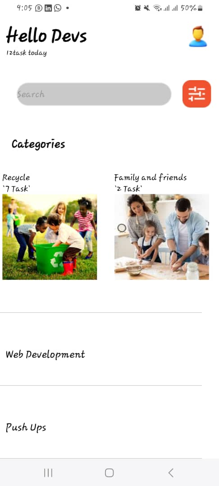

# DCIT 202 ASSIGNMENT #
Name  : Gbadago Frank Mawuli
ID    : 112323224

This is a small React Native mobile application that has a search bar, title bar, and a vertical and horizontal list of items.

## Table of Contents

- [DCIT 202 ASSIGNMENT](#dcit-202-assignment)
  - [Table of Contents](#table-of-contents)
  - [Introduction](#introduction)
  - [Features](#features)
  - [Screenshots](#screenshots)

## Introduction

This project is a simple mobile application developed using React Native for the DCIT 202 course assignment. The app includes a search bar for filtering items, a title bar, and displays lists of items both vertically and horizontally. This project is designed to help students understand the basics of React Native components, styling, and state management.

## Features

- A title bar that displays a greeting and a task summary.
- A search bar to filter items.
- A horizontal scrollable list of categories.
- A vertical list of tasks.

## Screenshots

Include screenshots or GIFs of your app. You can use Markdown to add images:

